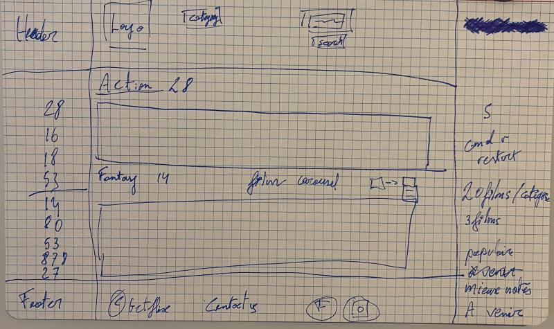

# Getflix Project

## Getflix

Le projet _"Getflix Project"_ était de mettre en place un site web pour une platforme de films en streaming, vous retrouvererez toutes les conditions juste [ici.](https://github.com/becodeorg/BXL-Swartz-4-27/blob/master/2.The-Hill/2.PHP/GetflixProject.md)

 

Vous pouvez retrouver notre site "Getflix" en me [cliquant dessus.](...futur site déployé)

La création du site s'est déroulée en plusieurs étapes: 
1. L'analyse des éléments devant être présent sur le site.
2. Une phase d'élaboration de croquis afin d'avoir une idée claire de la manière dont les pages seront présentées.
3. L'attribution des rôles de chaque membre de l'équipe (2 pour le frontend, 2 autres pour le backend).
4. La mise en place du squelette avec HTML.
5. La mise en page avec le CSS.
6. Un travail de recherche nécessaire sur le mise en place des différents éléments constituant le backend.
7. Une communication de groupe quotidienne permettant aux membres de se répartir les tâches au fur et à mesure de la progression du projet.

 

Vous trouverez juste en dessous un exemple de croquis réalisé en début de projet pour notre page "main page" présente sur le site.

- - - - - -

 
 

### "Getflix Main-page"

> Pour cette page l'idée initiale était de superposer des carrousels contenant des propositions de films par genre, entre notre navbar et notre footer. Par la suite nous avons décidé d'ajouter une section supplémentaire au dessus de nos carrousels, visant à permettre à l'utilisateur de rechercher directement des films dans la barre de recherche.

- - - - - -

## Technologies utilisées
 
  

 * HTML
 * CSS
 * JAVASCRIPT
 * PHP

 - - - -

## Equipe de travail

 

Le projet a été réalisé par :

* Nicolas Enuset, backend-developer (@Nicolas-Enuset).

* Alexendre Garcao, backend-developer (@alexg-rgb).

* Simon Aerts, project-manager et frontend-developer (@SimonAertsBecode).

* Sylvain Haenen, frontend-developer (@sylvainhaenen).

- - - - - -

## Copyright

 

Image de [Unsplash](https://unsplash.com/), merci au photographe Erik Witsoe.
